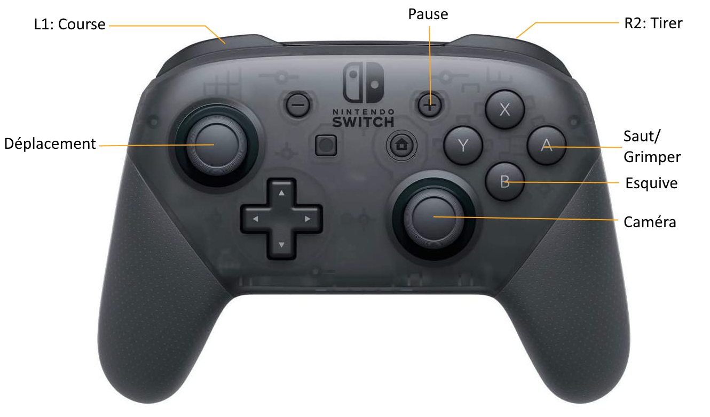

  

https://user-images.githubusercontent.com/91843760/221441428-bf7e701f-b3ef-4176-a6bf-5254ecf9acd0.mp4

## **Controls**

### QWERTY

Command             | Action
-------             | ------
W                   | Move forward
A                   | Move left
S                   | Move backward
D                   | Move Right
Left Shift          | Sprint
Left Ctrl           | Dodge
Space bar           | Jump
Esc / P             | Pause / Unpause the game
Move Mouse          | Move the camera around the player
Mouse Right Click   | Shoot

### **Gamepad**

